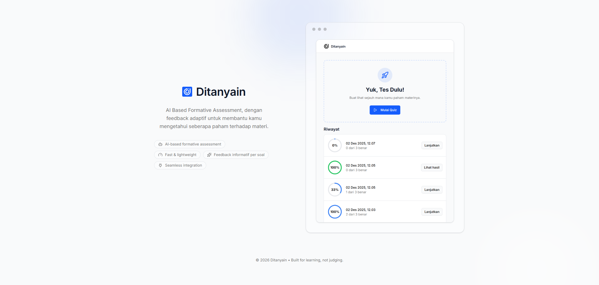
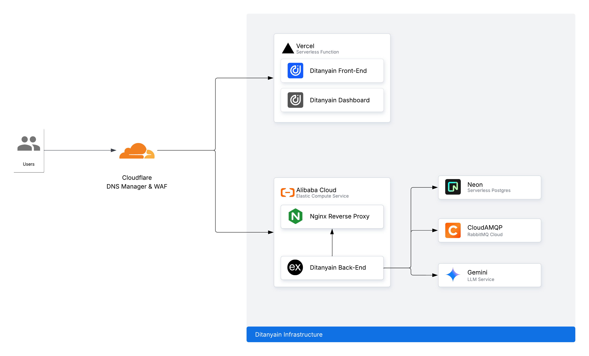

  

# Ditanyain: AI Based Formative Assessment

**Ditanyain** is an AI-based formative assessment platform integrated with Learning Management Systems (LMS). It automatically generates assessment questions from sub-module content and provides adaptive, informative feedback to help learners understand their progress more effectively.

## ✨ Meet The Awesome Team Behind Ditanyain

<table>
  <thead>
    <tr>
      <th>Role</th>
      <th>Name</th>
      <th>Profile</th>
    </tr>
  </thead>
  <tbody>
    <tr>
      <td>Project Manager</td>
      <td>Muhammad Rival Dwisatrio</td>
      <td>
        
        &nbsp;
        
      </td>
    </tr>
    <tr>
      <td rowspan="2">Back-End</td>
      <td>Galih Bagus Hardiyanto</td>
      <td>
        
        &nbsp;
        
        &nbsp;
        
      </td>
    </tr>
    <tr>
      <td>Abdurrohman Haadziq</td>
      <td>
        
        &nbsp;
        
        &nbsp;
        
      </td>
    </tr>
    <tr>
      <td rowspan="2">Front-End</td>
      <td>Khaerul Falah</td>
      <td>
        
        &nbsp;
        
      </td>
    </tr>
    <tr>
      <td>Cornelius Nathan</td>
      <td>
        
        &nbsp;
        
      </td>
    </tr>
  </tbody>
</table>

## 🏗️ Infrastructure

## 🛠️ Technical Components & Tools

### Back-End

#### Tech Stack

#### Contributors

  &nbsp;&nbsp;
  

### Front-End

#### Tech Stack

#### Contributors

  &nbsp;&nbsp;
  &nbsp;&nbsp;
  &nbsp;&nbsp;
  &nbsp;&nbsp;
  

### Dashboard

#### Tech Stack

#### Contributors

  

